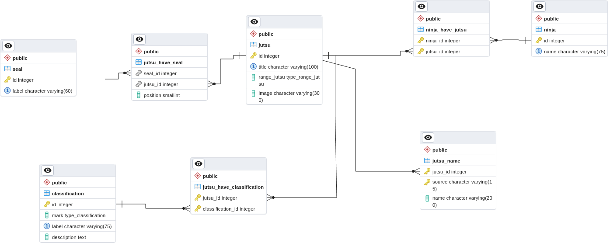
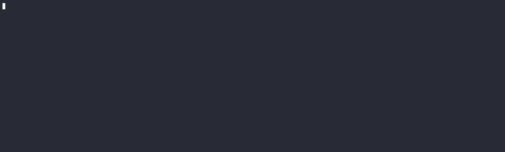

# Naruto Fandom Scraping

Este repositório foi criado para armazenar informações sobre todos os
jutsus encontrados na [Naruto Fandom pt-BR](https://naruto.fandom.com/pt-br/wiki/Categoria:Ninjutsu).
O banco de dados utilizado neste projeto é o [postgres:14.1](https://www.postgresql.org/).

## Sobre o banco de dados



Diagrama gerado a partir do [pgadmin](https://www.pgadmin.org/).

A ferramenta [schemaspy](https://github.com/schemaspy/schemaspy?tab=readme-ov-file) também foi utilizada para averiguar inconsistências
criadas nas versões iniciais da base de dados.

## Acessando a base

Instale o docker e docker-compose em sua máquina. [Tutorial](https://github.com/JoaoHenrique12/TutorialPostgreSQL/blob/main/DOCKER.md)

```bash
$ # Inicializando os containers.
$ docker-compose up -d
$
$ # Dando permissão de execução para o script que irá criar e inserir os
$ # dados na base.
$ chmod +x restart_db.sh
$
$ # Criando o banco de dados e inserindo os dados do dump mais recente.
$ ./restart_db.sh dumps/sweep_code_7ddd.sql
$
$ # Acessando o shell do postgres
$ docker exec -it naruto_fandom_scraping_postgres_1 psql -U postgres -d naruto_db
```

**Informações sobre os containers** : 
[docker-compose.yml](docker-compose.yml).

Com esta sequência de passos você acessa o shell do postgres. Se houver
algum erro ao executar o primeiro comando, considere trocar a porta do
pgadmin. 

Caso você prefira acessar a base utilizando o pgadmin
lembre-se de que quando for inserir o novo server defina
o Host name : postgres, ao invés de localhost. Lembre-se, os container
estão na rede chamada spider_web e uma maneira de acessar o host é 
através do container label.



## Como executar o web scrapper ?

[Tutorial](SCRAPPER.md)

O tutorial a cima só é útil para quem deseja compreender melhor sobre
como os dados foram obtidos da fandom. Ou para quem deseja fazer 
alterações no código principal e obter um dump diferente dos já 
existentes.